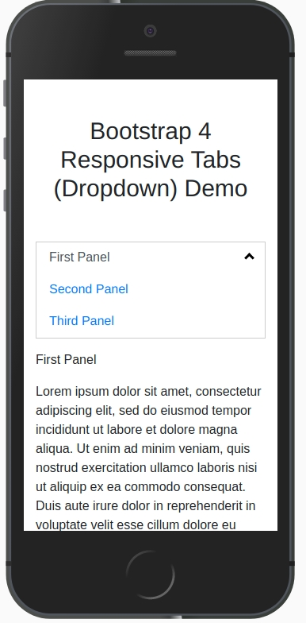

# bootstrap4-responsive-tabs

  

This library will make the bootstrap nav tabs as dropdown in below 768px screensize. Demo here: <a href="https://bootstrap4-responsive-tabs.herokuapp.com/">https://bootstrap4-responsive-tabs.herokuapp.com/</a>

Check the home.html file for your reference.

